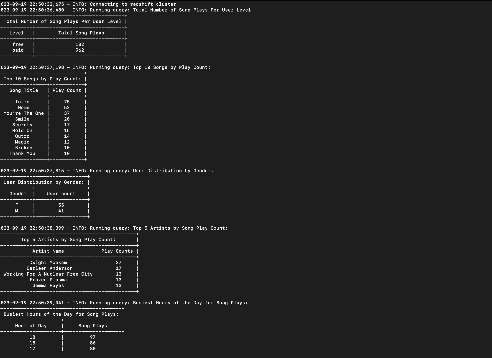

# Dataware House

An ETL pipeline that extracts data from S3, stages data in Redshift, and transforms data into a set of dimensional tables for an analytics team.

# Dependecies

- configparser
- prettytable
- psycopg2-binary
- Amazon Redshift database

# Project Setup

1. Create a virtualenv

```
 python -m venv .venv
```

Activate the environment and install requirements

```
 pip install -r requirements.txt
```

Make sure you have a Redshift cluster and add the following credentials to `dwh.cfg` file

```
[CLUSTER]
HOST=******.*****.us-west-2.redshift.amazonaws.com
DB_NAME=<your-db name>
DB_USER=<your-user-here>
DB_PASSWORD=<your-user-password-her>
DB_PORT=5439 or <your-port-here>
```

Make sure you've an IAM role that can access the aws s3 buckets and add it in `dwh.cfg`

```
[IAM_ROLE]
ARN=
```

# Running Project

Run the script to create staging and fact and dimensional tables

```
  ./create_tables.py  or  python create_tables.py
```

Run the script to populate staging tables and transform data and insert into fact and dimensional tables

```
  ./etl.py   or  python etl.py
```

Run the script to run some sample analysis queries

```
  ./analysis.py or  python ./analysis.py
```

Here is a screenshot of the results from those analysis queries



# Data Modeling

In the script `sql_queries` we model our data. We write queries to create staging events and staging songs table. We also create queries to populate these data with events and song data based in s3. We also create the fact and dimensional tables. We explain the choice of distribution style below.

When designing tables in Amazon Redshift or any distributed database, the choice of distribution style is a critical decision that can significantly impact query performance. The choice should be based on the nature of your data and the types of queries you expect to run. Let's examine the distribution style for each of your tables and how it can be improved:

1. **songplay Table:**

   - The `songplay` table has a `DISTKEY` of `start_time`, I expect many queries to filter or join data based on time `start_time`. I also considered use of the `user_id` column because it can be used in filtering by user.

2. **users Table:**

   - The `users` table has a distribution style of `ALL`, meaning it's replicated to all nodes since the data is relevantly small.

3. **song Table:**

   - The `song` table has a distribution style of `ALL` since the data is relevantly small.

4. **artist Table:**

   - The `artist` table also has a distribution style of `ALL`, since the data is relevantly small.

5. **time Table:**
   - The `time` table has a distribution style of `ALL`, since the data is relevantly small.
